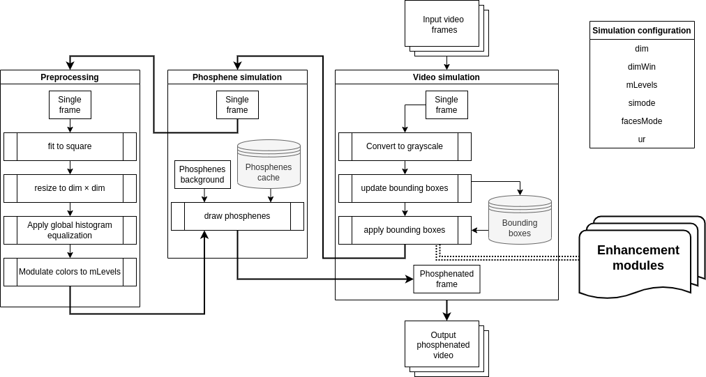

# To run the project
1. clone the repo
2. make sure to have python3 and pip commands on your local machine terminal
3. run **pip install --user pipenv**
4. fix the python version in the *pipfile* to match the version installed on your machine
5. run **pipenv install** in the project root directory  
6. run **pipenv shell** to spawn a shell in the virtual env of the project; to exit it run ctrl+d
7. run **python3 [Any].py**  
ANOTHER APPROACH  
8. instead of spwaning a pipenv shell, you can run **pipenv run** + some script from the *pipfile*. The *pipfile* includes commands that run the video simulation or the singelton image simulation.

## SPV Architecture

- The configuration variables could be set in the **simConfig.py** file
- The video simulation file is **videoSim.py** and the phosphene simulation file (singleton image simulation) is **phosphenesSim.py**
- The enhancement modules are the following:
    - caricaturing (found in **caricaturing/** directory)
    - emotion recognition (found in **emotion_recognition/** directory)
    - talking detection (found in **talking_detection/** directory)
    - face recognition (found in **face_recognition/** directory; this module was dropped in the study)
    - face specific histogram equalization (found in **bboxes.py** file as a function **heq()**)
- The **experiment/** directory contains the videos used in the computer screen simulation

